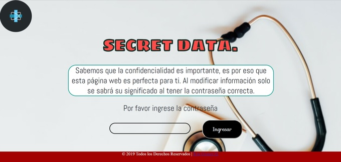

# Cifrado César

## SECRET DATA

-Es importante la confidencialidad de los resultados médicos, ya que hay muchos casos en los que se ha entregado al paciente un resultado no perteneciente. Es por eso que esta página ha sido creada.

##Research UX

°  Usuarios:  Personal médico/enfermerxs y los principales usuarios (pacientes)
-°Objetivos: Enfatizar la privacidad de resultados médicos a los usuarios/pacientes.
-°Soluciones que proporciona :Es importante la confidencialidad de los resultados médicos, ya que hay muchos casos en los que se ha entregado al paciente un resultado no perteneciente.

-Feedback: En el primer feedback de equipo me ayudaron mucho a concretar el tema de mi proyecto, ya que tenía una idea pero no estaba segura de si era la correcta. Después de eso pude avanzar con los siguientes pasos.

En las entrevistas previas mis entrevistados fueron dos personas un doctor y un paciente Las preguntas fueron acerca de la confidencialidad de la entrega de datos y como se sentirían al tener una herramienta que les permita acceder a estos con total seguridad. Los resultados fueron positivos, ya que dijeron qeu sería muy útil y que lo usarían. Cabe resaltar que más allá de solo doctores y pacientes entra en escena la entidad, en este caso la clínica u hospital que concede usar esta página web, dejando este tema aparte a los entrevistados les agradó esta iniciativa por lo que resultó ser una idea útil.

-Link de formulario de planificación : https://docs.google.com/document/d/1GrfllBJHUnJRPOSuoYgsr5X69wAfilb7P2zvDVqeY_c/edit

### Imágenes del prototipo en Balsamiq.

-Feedback 2: Al presentar el primer avance terminado a compañeras dieron comentarios en cambios de color y tamaño de fuentes (letras) como también de estilo de fuente.

-Después de tomar en cuenta el feedback de mis compañeras, hice cambios en CSS, tanto para el color de textos y botones, y por último, el fondo de la página.
 

