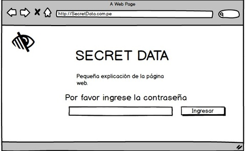
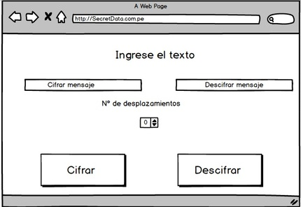
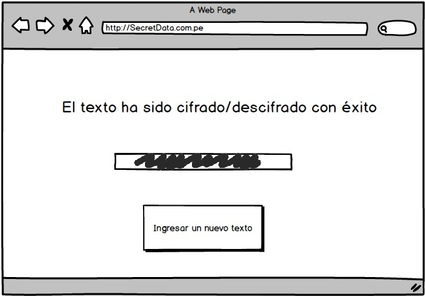
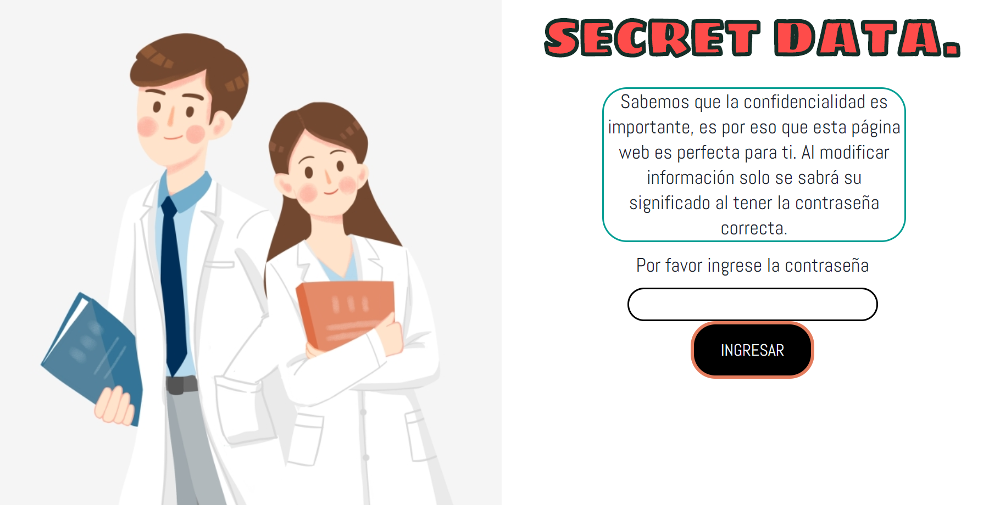

# Movies

## SECRET DATA

<<<<<<< HEAD
- [Índice](#índice)
- [Resumen del proyecto](#resumen-del-proyecto)
- [Investigación UX](#investigacion-ux)
  - [Usuarios](#usuarios)
  - [Objetivos del proyecto](#objetivos-del-proyecto)
  - [Soluciona los problemas / necesidades del usuario](#soluciona-los-problemas-necesidades-del-usuario)
  - [Colocación del primer prototipo en papel](#colocacion-del-primer-prototipo-en-papel)
  - [Resumen del feedback](#resumen-del-feedback)
  - [Imagen final en Balsamiq Mockup](#imagen-final-en-balsamiq-mockup)
  - [Feedback Final](#feedback-final)

## Resumen del proyecto

En este proyecto se trata de una aplicación web que le permita interactuar al usuario cifrando y descifrando la parte final de una película en estreno,
por lo cual conlleva a enterarse el final de las películas de manera reservada.
Los usuarios son cualquier persona natural (cinefilos).

## Investigación UX

### Usuarios
Los usuarios son cualquier persona natural (cinéfilos).

### Objetivos del proyecto

El objetivo en relación con el producto:
- Cifrar el final de la película en mención en letras del abecedario.
- Descifrar el cifrado del final de la película ingresada.

### Soluciona los problemas / necesidades del usuario

- En este proyecto las necesidades del usuario es enterarse el final de la película, para no arruinar la ilusión de las personas que verán la película.
Este sitio esta creado para que el mensaje sea encriptado de manera confidencial y desencriptado para la persona que va dirigido el mensaje.

### Colocación del primer prototipo en papel

### Resumen del feedback
- En el feedback de las mejoras que realicé en prototipo de papel es generar una sola pantalla para cifrar y descifrar, ya no como muestro en la figura anterior,
generando en pantallas diferentes.

### Imagen final en Balsamiq Mockup

### Feedback Final

- En el feedback las mejoras que realicé en prototipo de papel es muy diferente a lo que se generó ahora, pues en una pantalla muestra los botones de cifrar, limpiar y descifrar, en un solo bloque en horizontal, lo mismo para el botón regresar y el botón enviar, realizé un cambio del background de la pantalla agregé el botón enviar, ya no como muestro en la figura anterior.
=======
-Es importante la confidencialidad de los resultados médicos, ya que hay muchos casos en los que se ha entregado al paciente un resultado no perteneciente. Es por eso que esta página ha sido creada.

##Research UX

°  Usuarios:  Personal médico/enfermerxs y los principales usuarios (pacientes)
-°Objetivos: Enfatizar la privacidad de resultados médicos a los usuarios/pacientes.
-°Soluciones que proporciona :Es importante la confidencialidad de los resultados médicos, ya que hay muchos casos en los que se ha entregado al paciente un resultado no perteneciente.

-Feedback: En el primer feedback de equipo me ayudaron mucho a concretar el tema de mi proyecto, ya que tenía una idea pero no estaba segura de si era la correcta. Después de eso pude avanzar con los siguientes pasos.

En las entrevistas previas mis entrevistados fueron dos personas un doctor y un paciente Las preguntas fueron acerca de la confidencialidad de la entrega de datos y como se sentirían al tener una herramienta que les permita acceder a estos con total seguridad. Los resultados fueron positivos, ya que dijeron qeu sería muy útil y que lo usarían. Cabe resaltar que más allá de solo doctores y pacientes entra en escena la entidad, en este caso la clínica u hospital que concede usar esta página web, dejando este tema aparte a los entrevistados les agradó esta iniciativa por lo que resultó ser una idea útil.

-Link de formulario de planificación : https://docs.google.com/document/d/1GrfllBJHUnJRPOSuoYgsr5X69wAfilb7P2zvDVqeY_c/edit

### Imágenes del prototipo en Balsamiq.

-Feedback 2: Al presentar el primer avance terminado a compañeras dieron comentarios en cambios de color y tamaño de fuentes (letras) como también de estilo de fuente.

-Después de tomar en cuenta el feedback de mis compañeras, hice cambios en CSS, tanto para el color de textos y botones, y por último, el fondo de la página.

-Feedback 3: Quise tomar en cuenta las opiniones de otras personas fuera de mi entorno y algo que fue muy común fue el de implementar un botón que limpie la pantalla para que borre lo que ya había escrito.

-Fue por eso que implementé un botón con las función reset dentro de mi form.
 

>>>>>>> cfd108475fadc7a88c3faf1e13b264caa59e3706
