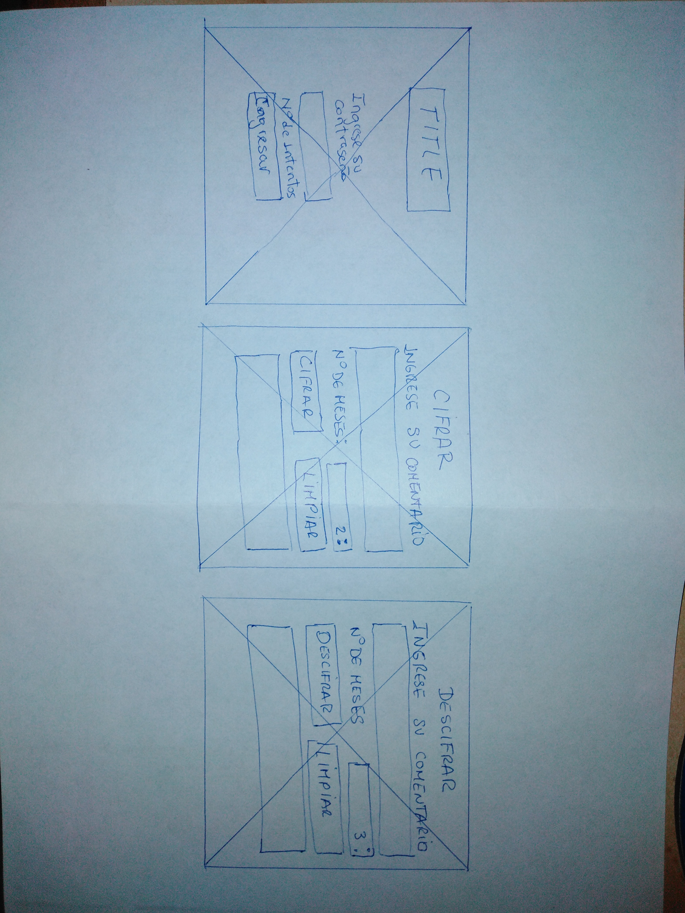

# Movies

## Índice

- [Índice](#índice)
- [Resumen del proyecto](#resumen-del-proyecto)
- [Imagen del proyecto](#imagen-del-proyecto)
- [Investigación UX](#investigacion-ux)
  - [Usuarios](#usuarios)
  - [Objetivos del proyecto](#objetivos-del-proyecto)
  - [Soluciona los problemas / necesidades del usuario](#soluciona-los-problemas-necesidades-del-usuario)
- [Feedback](#feedback)

## Resumen del proyecto

En este proyecto se trata de una aplicación web que le permita interactuar al usuario cifrando y descifrando la parte final de una pelicula en estreno,
por lo cual conlleva a enterarse el final de las peliculas de manera reservada.
Los usuarios son cualquier persona natural (cinefilos).

## Imagen del proyecto

## Investigación UX

### Usuarios
Los usuarios son cualquier persona natural (cinefilos).

### Objetivos del proyecto

El objetivo en relacion con el producto:
- Cifrar el final de la película en mención en letras del abecedario.
- Descifrar el cifrado del final de la película ingresada.

### Soluciona los problemas / necesidades del usuario

- En este proyecto las necesidades del usuario es enterarse el final de la pelicula, para no arruinar la ilusion de las personas que veran la pelicula.
Este sitio esta creado para que el mensaje sea encriptado de manera confidencial y desencriptado para la persona que va dirigido el mensaje.

## Feedback

En el feedback de las mejoras que realicé en prototipo de papel es generar una sola pantalla para cifrar y descifrar, ya no como muestro en la figura 1,
generando en pantallas diferentes.
